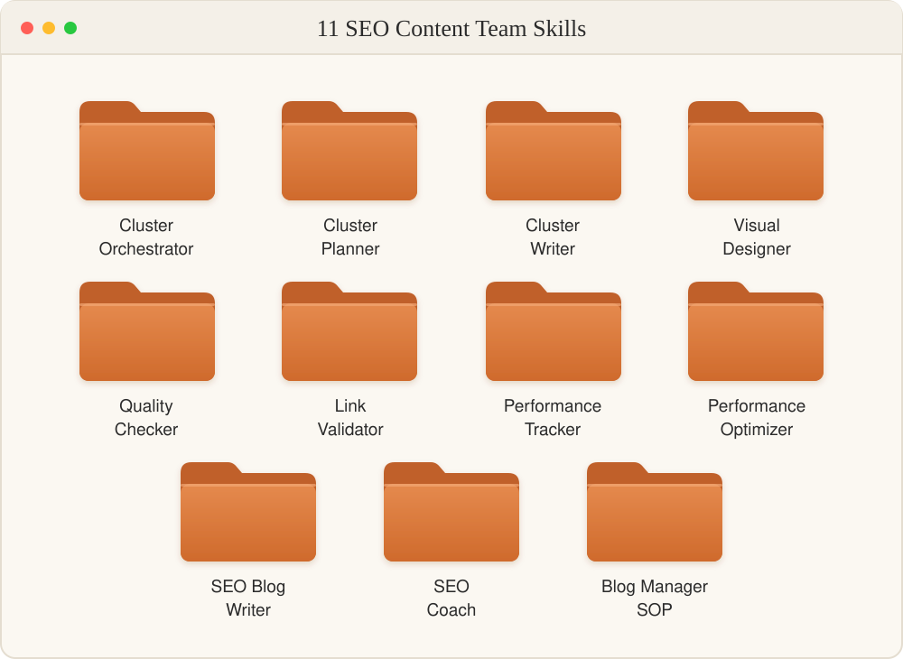
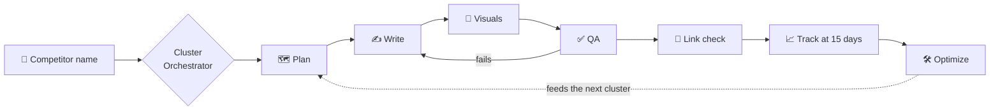

<div align="center">

# SEO Content Team

### A full SEO content team, as Claude skills.

**Eleven skills that plan, write, design, QA, interlink and track complete competitor comparison clusters: the bottom-of-funnel "{Product} vs {Competitor}" content that sits closest to a buying decision.**

**Built on the hub-and-spoke pattern behind some of the most successful comparison content in SaaS.**


<br/>



[What you get](#what-you-get) · [How it works](#how-it-works) · [The eleven skills](#the-eleven-skills) · [Install](#install-in-2-minutes) · [FAQ](#faq)

</div>

---

## Your buyers are Googling "{you} vs {them}". Who answers?

Every competitor comparison search is a buyer one step from a decision. When you have no page for it, your competitor, a review site or an affiliate listicle answers instead.

The best SaaS companies don't write one comparison post. They build a **cluster**: a deep pillar comparison, an alternatives listicle, a migration guide, customer stories and a narrative post, all linked to each other so the pillar ranks and every spoke feeds it.

That's weeks of work for a content team. **This pack is that team.** Name a competitor, confirm the scope, and the skills run the whole build, then keep tracking and improving it after launch.

## What you get

From **one** competitor name:

| Asset | What ships | Built by |
|---|---|---|
| 🗺️ **Cluster plan** | Live SERP, People Also Ask and competitor analysis, keyword map per spoke, link topology | `cluster-planner` |
| 🏛️ **Pillar comparison** | ~5,000 words: feature tables, pricing scenarios, "when to choose" block, 20-question FAQ | `cluster-writer` |
| 📋 **Alternatives listicle** | Main entries plus honorable mentions, each linking back to the pillar | `cluster-writer` |
| 🔁 **Migration guide** | A step-by-step, second-person tutorial built only on documented features | `cluster-writer` |
| 🎨 **Visual briefs** | A hero image per post, one shared CTA and newsletter banner, listicle screenshots. Minimal by design | `cluster-visual-designer` |
| ✅ **QA report** | A strict pre-publish audit of every post, with pass/fail and fixes | `cluster-quality-checker` |
| 🔗 **Link topology check** | Proof every spoke and the pillar link both ways, with no orphans or competitor links | `cluster-link-validator` |
| 📈 **15-day performance report** | Search Console clicks, impressions, CTR and position per post, plus live-page drift checks | `cluster-performance-tracker` |
| 🛠️ **Optimization plan** | Specific rewrites and fixes from the performance data | `cluster-performance-optimizer` |

Plus **`seo-blog-writer`** for standalone posts, **`seo-coach`** for Semrush-powered guidance, and **`blog-manager-sop`**, the operating manual for running the blog.

## How it works



**It's resumable.** Cluster state is saved to a file after every step, so you can pause for data, fix a failed QA and pick up exactly where you left off.

**It improves itself.** The tracker runs 15 days after launch and the optimizer turns the results into fixes. What it learns feeds the next cluster.

## Why this beats "write me a comparison post"

- **A cluster, not a post.** One pillar plus spokes, all linked both ways with descriptive anchors, which is the structure that lets a comparison page actually rank.
- **Reverse-engineered from a proven pattern.** The templates come from a line-by-line structural teardown of PostHog's public Mixpanel comparison cluster: section order, table formats, FAQ length and link density.
- **Zero invented features.** Every skill reads one `product-context.md`. If a feature, customer or number isn't documented there, the writer refuses to claim it.
- **Honest by design.** Every pillar needs at least three concession lines where the competitor genuinely wins. Buyers trust that, and so does Google.
- **Nothing ships without QA.** Every post has to pass the quality checker before the cluster moves on.
- **Live SERP research, every time.** The planner never plans from memory. It analyzes what actually ranks today.
- **Measured, not guessed.** Real Search Console data every 15 days, plus checks that each live page still renders its title, canonical and schema.
- **Visuals that earn their place.** Following PostHog's pattern, no decorative infographics: a hero per post, shared banners, and screenshots only where they identify a tool.
- **Semrush-powered coaching.** `seo-coach` reads your real Semrush data and tells you the single best next step.

## The eleven skills

<details>
<summary><b>🧠 cluster-orchestrator</b>: runs the whole build</summary>

Captures scope, sets up the working folder and state file, runs every skill in order, and delivers the finished cluster with an index README. Resumes any paused cluster from its last completed stage.
</details>

<details>
<summary><b>🗺️ cluster-planner</b>: the research and the plan</summary>

Live SERP, People Also Ask and competitor analysis. Outputs the cluster plan: which spokes to build, the keyword for each, the H1s, FAQ questions, concession lines and the full link topology.
</details>

<details>
<summary><b>✍️ cluster-writer</b>: one post at a time, done properly</summary>

Writes each post from the proven templates: pillar, alternatives listicle, migration guide, narrative and customer stories. It enforces the voice rules and the verified-features rule, and adds Article and FAQPage schema.
</details>

<details>
<summary><b>🎨 cluster-visual-designer</b>: minimal on purpose</summary>

Visual briefs and SVG specs that follow PostHog's deliberately minimal pattern: one hero image per post, one shared CTA banner and newsletter banner per cluster, and one screenshot per listicle entry. No infographics, by design.
</details>

<details>
<summary><b>✅ cluster-quality-checker</b>: the gate before publishing</summary>

A strict checklist audit of every post: structure, claims against product context, links, schema, voice and style. It returns pass or fail with the exact fixes.
</details>

<details>
<summary><b>🔗 cluster-link-validator</b>: proves the topology</summary>

Checks every spoke links to the pillar, the pillar links to every spoke, anchors are descriptive and no link points at a competitor.
</details>

<details>
<summary><b>📈 cluster-performance-tracker</b>: the 15-day check-in</summary>

Ingests your Search Console exports for every cluster URL, checks each live page for title, canonical and schema drift, updates the cluster Google Sheet and writes a per-post report.
</details>

<details>
<summary><b>🛠️ cluster-performance-optimizer</b>: turns data into fixes</summary>

Reads the tracker's report and prescribes specific changes: titles to rewrite, sections to expand, links to add, FAQs to target.
</details>

<details>
<summary><b>📝 seo-blog-writer</b>: one post that can rank</summary>

Top-tier on-page SEO for standalone B2B posts, including comparisons, alternatives, listicles and reviews, using the hub-and-spoke model.
</details>

<details>
<summary><b>🧭 seo-coach</b>: your Semrush-powered guide</summary>

A friendly coach mode. It reads your real Semrush data (rankings, competitors, keyword difficulty, backlinks), explains it in plain language, and recommends the single next workflow to run.
</details>

<details>
<summary><b>📚 blog-manager-sop</b>: the operating manual</summary>

A reference document for whoever runs the blog: roles, cadence, publishing checklist and escalation rules. Read it rather than run it.
</details>

## Install in 2 minutes

### Option 1: Claude Code plugin

```
/plugin marketplace add rohitabrahamgeorge/seo-content-team
/plugin install seo-content-team@seo-content-team
```

### Option 2: Copy the skills

```bash
git clone https://github.com/rohitabrahamgeorge/seo-content-team.git
cp -R seo-content-team/skills/* ~/.claude/skills/
```

### Option 3: Claude.ai

Zip each folder in `skills/` and upload it in Claude.ai under **Settings > Capabilities > Skills**.

## Set up once: your product context

Every skill reads one file, `product-context.md`, placed at the root of your working folder. It holds your product, positioning, verified features, proof points, pricing, voice and competitor set.

You don't have to write it by hand. The first time you run the orchestrator, it copies the [template](skills/cluster-planner/references/product-context-template.md) and fills it in with you through a short interview.

**Keep it honest.** The skills treat that file as the only truth about your product, and anything missing from it won't be claimed.

## Use it

> **"Build the {Product} vs {Competitor} cluster."**

Or run one piece at a time:

> "Plan a {Competitor} alternatives cluster." · "Write the pillar." · "QA this post." · "Check the cluster links." · "Run the 15-day performance check." · "Coach me: where should I start?"

**Recommended connections:** Google Search Console exports and a Google Sheet for tracking, Google Drive and Calendar for storage and reminders, and the Semrush MCP for `seo-coach`.

## FAQ

**Is this only for SaaS?**
It's tuned for B2B and SaaS comparison content, but it works wherever buyers compare two products before choosing: software, services, platforms and tools.

**Will it make claims about my competitors that aren't true?**
The planner researches live competitor pages, and the QA checker flags unsupported claims. You still review before publishing, because your name is on it.

**Do I need Semrush?**
Only for `seo-coach`. The cluster workflow runs on live web research plus your Search Console data.

**Can I change the voice rules?**
Yes. The defaults are no em dashes, no ampersands and sentence case headings. Override them in the Voice section of `product-context.md`, or point it at your own brand voice skill.

## Want a cluster built for you?

I built these skills to run real comparison content programs. If you want help setting them up for your product, a done-with-you first cluster, or custom skills for your content workflow, [open an issue](https://github.com/rohitabrahamgeorge/seo-content-team/issues) or reach out through [my GitHub profile](https://github.com/rohitabrahamgeorge).

**Also by me:** [Podcast Repurposing Engine](https://github.com/rohitabrahamgeorge/podcast-repurposing-engine), nine skills that turn one transcript into a month of content.

<div align="center">

**If this saves your team a week, ⭐ star the repo** so other marketers can find it.

</div>

## License

MIT. Free to use, fork and adapt, including for client work. See [LICENSE](LICENSE).

PostHog and Mixpanel are referenced as a public example of comparison content. This project is not affiliated with either company.
